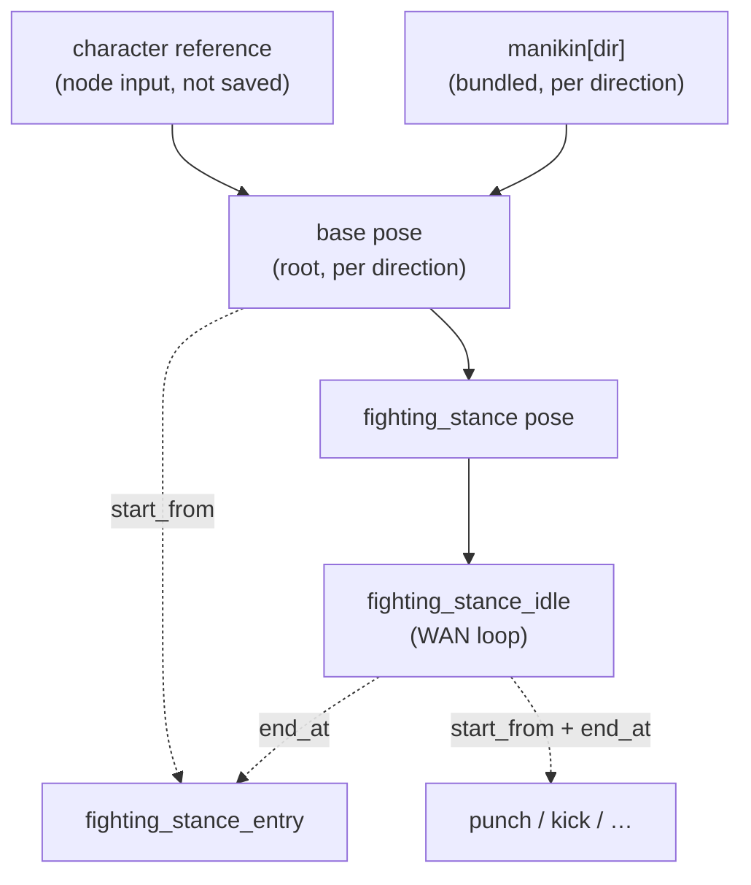

# comfyui-andypack — Animation Coordinator

A ComfyUI custom-node pack for building large, **direction-aware character
animation sets** from a single manifest. It is a dependency-aware **FFLF**
(first-frame / last-frame) resolver: it drives `character → pose → animation`
selection from one `animations.json`, gates what you can generate on what is
already rendered, and feeds your sampler the right positive/negative prompts and
start/end anchor images.

It does **not** sample or generate. You build the FLUX (pose/frame edits) and
WAN (animation) graph; this pack resolves prompts, reference images, dependency
gating, and completion metadata, and writes the results back to disk so the next
node in the chain unlocks.

---

## Mental model

Everything is one dependency graph of two rendered node kinds, rooted at the
**base** pose:



- **Base pose** — the tree root. Each of its 8 directions is a FLUX multi-
  reference edit of the **character reference image** (a Character Creator input,
  *not persisted*) paired with the bundled **manikin** for that direction (which
  supplies the camera angle / body orientation). Renders to `_base/{dir}.png` +
  a sidecar. A character's prompt layer lives in `character.json` (no image, no
  provenance).
- **Pose** — a per-direction still produced by a FLUX edit of a *source image*
  (another pose). A pose with no `from` is a root pose (base). Renders to
  `_{pose}/{dir}.png` + a sidecar.
- **Animation** — a WAN clip. Renders to `{anim}/{dir}/frame_*.png` + `meta.json`.

### FFLF cross-wiring

Every animation needs a **start image** (the I2V initial latent): its explicit
`start_from`, otherwise the manifest's `defaults.start_from`. `end_at` is
optional — when present, the clip is FFLF. The cross-wiring is:

- `start_from` consumes the dependency's **last** frame.
- `end_at` consumes the dependency's **first** frame.
- A single-image dep (a pose) resolves the same image for either slot.

**Looping is a consequence of FFLF, not a flag.** There is no `loop` field. A
clip loops when its start and end anchors resolve to the *same image* (e.g.
`start_from` and `end_at` both pointing at one pose) — it begins and ends on the
same frame. The Animation Frame Writer detects that and drops the duplicated
final frame so the clip plays seamlessly on repeat.

### Cascading prompts

Each render's final positive and negative are merged from layers, general →
specific:

```
globals[kind] → entity → entity.directions[dir]
```

The character prompt layer (`character.json`) and the per-direction layer are
**not** cascade layers — they surface only via the opt-in template variables
`{character_prompt}`, `{direction_prompt}`, and `{direction_name}`.

Positives are joined as prose; negatives are merged as a deduped, comma-separated
term list. The merged prompt is hashed into the sidecar/`meta.json` as
`prompt_hash`.

### Staleness

Staleness is **transitive on the prompt hash**. A complete node is `stale` if its
own merged-prompt hash drifted from what was rendered, **or** any ancestor is
stale. Editing the character prompt layer or any cascade layer ripples
downstream. A stale node stays selectable — it just shows amber so you know to
re-render.

---

## Installation

Clone (or symlink) this repo into your ComfyUI `custom_nodes/` directory:

```bash
cd ComfyUI/custom_nodes
git clone https://github.com/andyhite/comfyui-andypack.git
```

Restart ComfyUI. The nodes appear under the **andypack** category, and the web
extension (`web/anim_coord.js`) loads automatically.

Runtime deps are the ones ComfyUI already provides (`torch`, `numpy`, `Pillow`,
`aiohttp`). No extra install step is required for normal use.

### Where files live

| What | Location |
|---|---|
| Manifests | `ComfyUI/user/default/andypack/animations/*.json` |
| Character output | `ComfyUI/output/characters/<character>/` |

A **character** is any directory under the characters root containing a
`character.json`, a pose dir, or an animation dir. The reference image is *not*
saved — it lives in your graph as a Character Creator input.

```
output/characters/cortex/
  character.json                    character prompt layer { positive_prompt?, negative_prompt? } (no image, no provenance)
  _base/EAST.png   _base/EAST.json  base pose frame + sidecar (the tree root)
  fighting_stance_idle/EAST/
    frame_00000.png … frame_000NN.png
    meta.json                       written LAST (atomic) = completion sentinel
```

There is no `.complete` file. The sidecar / `meta.json` is written **last** via
temp-file + atomic rename; its presence is the completion signal. A directory
with no parseable meta/sidecar reads as incomplete.

---

## Nodes

All nodes live in the **andypack** category. Custom passthrough types:
`ANIM_MANIFEST` (the loaded, validated manifest) and `ANIM_META` (a resolve
result handed from a selector to its writer).

| Node | Role |
|---|---|
| **Animation Manifest Loader** | Load + validate `animations.json` (ref typing, cycle detection, `4n+1` length warnings). Cached by file mtime. |
| **Character Creator** | Write a character's `character.json` prompt layer and emit the base-pose job for one direction, pairing the reference image (`SOURCE_IMAGE`) with the bundled manikin (`POSE_REFERENCE`) for a multi-reference FLUX.2 edit. The reference image is *not* persisted. |
| **Character Pose Selector** | Pick `character → category → pose → direction` (dynamic combos; root poses like `base` are excluded — use the Character Creator). Loads the `from`-source image, emits merged prompts + `OUTPUT_DIR` + `META`. Raises if the selection isn't selectable. |
| **Pose Frame Writer** | Write `{dir}.png` then the `{dir}.json` sidecar last (atomic). Returns `OUTPUT_DIR`. |
| **Character Animation Selector** | Pick an animation + direction. Emits `START_IMAGE`, `END_IMAGE`, `IS_FFLF`, `LENGTH`, `FPS`, merged prompts, `OUTPUT_DIR`, `META`. `LENGTH`/`FPS` wire straight into the WAN sampler. |
| **Animation Frame Writer** | Write `frame_{:05d}.png`, trim the duplicate closing frame of a seamless loop, then write `meta.json` last (atomic). Returns `OUTPUT_DIR`. |
| **Mirror Frame Writer** | Synthesize a `mirror_map` direction (e.g. WEST from EAST) by horizontally flipping the already-rendered payload — no sampling. |
| **Coverage Report** | A status table over every `(entity, direction)` for a character: generated / ready / stale / blocked, plus a JSON blob. |
| **Regen Queue** | The selectable-now (ready/stale) cells in dependency order — a work list for batch regeneration. |
| **Manifest Lint** | Surface non-fatal manifest findings (Wan-unfriendly lengths, directions outside the canonical list). |

### Typical graph

1. **Animation Manifest Loader** → `MANIFEST`.
2. **Character Creator** per base direction (reference image + manikin → base
   pose) → FLUX multi-reference edit (`SOURCE_IMAGE` first, `POSE_REFERENCE`
   second) → **Pose Frame Writer**. The reference image is not persisted — keep
   it in your graph to regenerate base directions later.
3. **Character Pose Selector** → FLUX edit → **Pose Frame Writer**. Walk poses
   in dependency order (poses that build on `base`).
4. **Character Animation Selector** → WAN sampler → **Animation Frame Writer**.

The web extension repopulates the combos with live status glyphs after each
writer run, so newly-unlocked nodes appear without a manual refresh:

> ✅ generated · 🟢 ready · 🟠 stale · 🔴 blocked

---

## Manifest

The manifest is **character-agnostic and identity-free** — per-character prompt
text lives only in each character's `character.json`. See
[`examples/animations.json`](examples/animations.json) for a full, working
manifest and [the design spec](docs/superpowers/specs/2026-06-29-cascading-pose-resolver-design.md)
for the authoritative schema.

Top-level keys: `version`, `directions` (canonical 8-way ordering),
`mirror_map`, `defaults` (`fps` / `length` / `start_from`), `globals`
(`animation` / `pose` cascade layers), `poses`, and `animations`. The `base`
pose has no `from` (it is the tree root) and lists all 8 directions.

A character can extend the manifest with its own `poses` / `animations` by adding
them to its `character.json`; the merged manifest is re-validated, so a bad ref or
a cycle is rejected rather than resolved silently.

### Manikins

The 8 bundled pose references in `andypack/assets/manikins/<DIR>.png` (one per
canonical direction) supply the camera angle / body orientation for the base
pose. The Character Creator pairs the character reference image with the matching
manikin as a second FLUX.2 reference, so all 8 base directions are generated
directly — base does not rely on `mirror_map`.

---

## HTTP routes

Registered on `PromptServer.instance.routes` when running inside ComfyUI:

| Route | Purpose |
|---|---|
| `GET /anim_coord/ping` | Liveness check the frontend uses before enabling inputs. |
| `GET /anim_coord/characters?root=…` | List character directories. |
| `GET /anim_coord/manifest_options?manifest=…` | Pose/animation → directions map (no rendered tree needed). |
| `GET /anim_coord/options?manifest=…&character=…` | Every `(pose|animation, direction)` with its status + `blocked_by`. |
| `GET /anim_coord/resolve?…&id=…&direction=…` | Full resolve with source / dual anchor previews. |
| `GET /anim_coord/frame?root=…&path=…&v=…` | Streams a PNG. `path` is confined under `root`, and `root` is confined to the ComfyUI output tree — anything outside 404s. |

---

## Development

```bash
pytest -q                 # tests
ruff check .              # lint
mypy andypack            # types
```

The resolver core (`andypack/resolve.py`, `andypack/manifest.py`,
`andypack/io.py`, `andypack/api.py`) is **pure stdlib** — no ComfyUI or torch
imports — so it is fully unit-testable from the fixtures in `tests/`. The
torch/PIL bridge is isolated in `andypack/images.py`, and the ComfyUI node
classes in `andypack/nodes.py` are thin wrappers over the pure core.

### Layout

| Module | Responsibility |
|---|---|
| `andypack/manifest.py` | Load, validate, ref-classify, cycle-detect. |
| `andypack/resolve.py` | Merge prompts, hash, completeness, anchors, transitive staleness. |
| `andypack/io.py` | Atomic writes, meta/sidecar builders, path safety. |
| `andypack/api.py` | JSON payload builders for the HTTP routes. |
| `andypack/server.py` | aiohttp route registration. |
| `andypack/nodes.py` | ComfyUI node classes. |
| `andypack/images.py` | torch/PIL ↔ ComfyUI IMAGE tensors. |
| `web/anim_coord.js` | Frontend: dynamic combos, status glyphs, anchor previews. |
