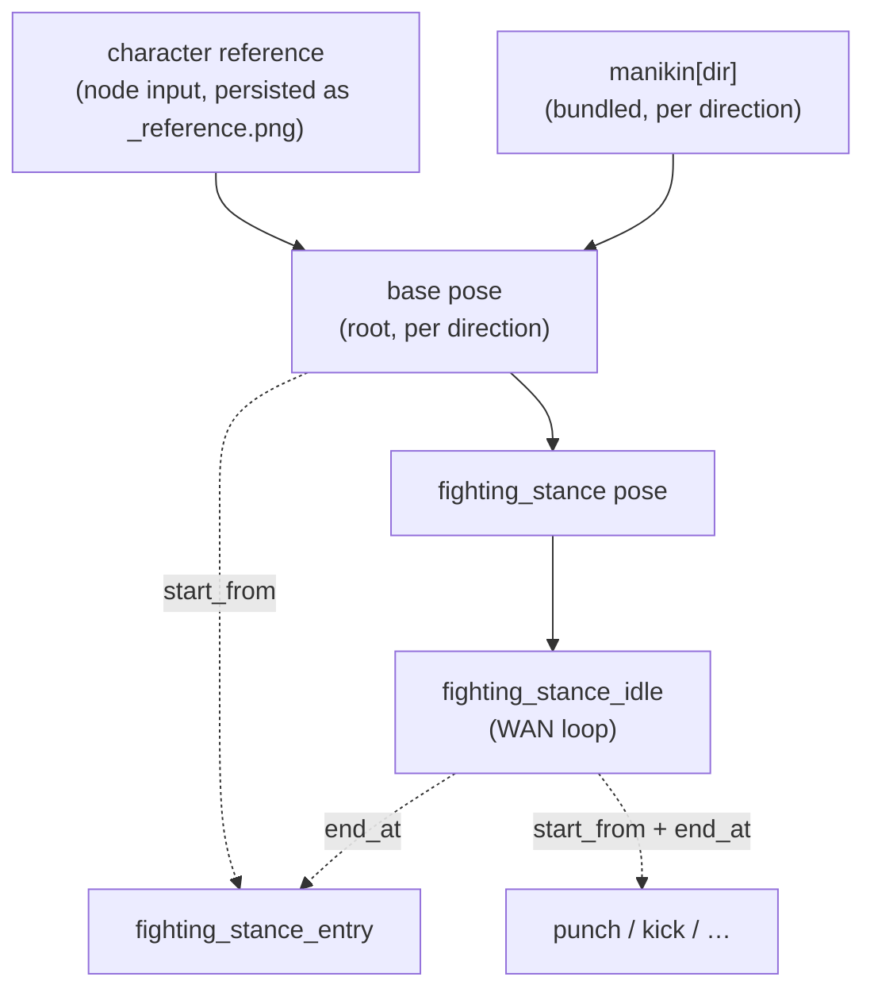

# comfyui-andypack — Animation Coordinator

A ComfyUI custom-node pack for building large, **direction-aware character
animation sets** from a single manifest. It is a dependency-aware **FFLF**
(first-frame / last-frame) resolver: it drives `character → pose → animation`
selection from one `animations.json`, gates what you can generate on what is
already rendered, and feeds your sampler the right positive/negative prompts and
start/end anchor images.

It does **not** sample or generate. You build the FLUX (pose/frame edits) and
WAN (animation) graph; this pack resolves prompts, reference images, dependency
gating, and completion metadata, and writes the results back to disk so the next
node in the chain unlocks.

---

## Mental model

Everything is one dependency graph of two rendered node kinds, rooted at the
**base** pose:



- **Base pose** — the tree root. Each of its 8 directions is a FLUX.2 multi-
  reference edit of the **character reference image** (a Character Creator input,
  persisted as `_reference.png` so it can be reloaded) paired with the bundled
  **manikin** for that direction (which supplies the camera angle / body
  orientation). Renders to `_base/{dir}.png` + a sidecar. A character's prompt
  layer lives in `character.json` (no provenance — base sidecars root staleness).
- **Pose** — a per-direction still produced by a FLUX.2 edit of a *source image*
  (another pose). A pose with no `from` is a root pose (base). Renders to
  `_{pose}/{dir}.png` + a sidecar.
- **Animation** — a Wan 2.2 i2v clip. Renders to `{anim}/{dir}/frame_*.png` +
  `meta.json`.

### FFLF cross-wiring

Every animation needs a **start image** (the I2V initial latent): its explicit
`start_from`, otherwise the manifest's `defaults.start_from`. `end_at` is
optional — when present, the clip is FFLF. The cross-wiring is:

- `start_from` consumes the dependency's **last** frame.
- `end_at` consumes the dependency's **first** frame.
- A single-image dep (a pose) resolves the same image for either slot.

**Looping is a consequence of FFLF, not a flag.** There is no `loop` field. A
clip loops when its start and end anchors resolve to the *same image* (e.g.
`start_from` and `end_at` both pointing at one pose) — it begins and ends on the
same frame. The Animation Frame Writer detects that and drops the duplicated
final frame so the clip plays seamlessly on repeat.

### Cascading prompts

Each render's final positive and negative are merged from layers, general →
specific:

```
globals[kind] → entity
```

The character prompt layer (`character.json`) and the per-direction layer are
**not** cascade layers — they surface only via the opt-in template variables,
resolved by field context (positive vs negative):

| Variable | Expands to |
|---|---|
| `{character_prompt}` | the character's `positive_prompt` / `negative_prompt` |
| `{view_phrase}` | the manifest-level `view_phrases[direction]` camera phrase (positive only) |
| `{direction_prompt}` | the entity's own per-direction `positive_prompt` / `negative_prompt` |
| `{direction_name}` | the bare direction name (e.g. `EAST`) |

`{view_phrase}` is the key to the 8-direction workflow: per-direction camera
language lives **once** in the manifest's `view_phrases` map, so every pose and
animation can opt into all 8 directions with empty per-direction layers and still
get correct, affirmative view language — including the turnaround failure-mode
mitigations ("only one eye visible" on profiles, "no face visible" on back
views). The manifest stays **character-agnostic**: identity arrives only via
`{character_prompt}`.

Positives are joined as prose; negatives are merged as a deduped, comma-separated
term list. The merged prompt is hashed into the sidecar/`meta.json` as
`prompt_hash`.

> **FLUX.2 Klein has no negative-prompt path**, so the seed manifest's poses carry
> no negative layer — pose failure modes are mitigated affirmatively in the
> positive (via `view_phrases`). The negative pipeline is for the Wan animation
> path (effective at CFG > 1). See [`docs/prompting-guide.md`](docs/prompting-guide.md).

### Staleness

Staleness is **transitive on the prompt hash**. A complete node is `stale` if its
own merged-prompt hash drifted from what was rendered, **or** any ancestor is
stale. Editing the character prompt layer or any cascade layer ripples
downstream. A stale node stays selectable — it just shows amber so you know to
re-render.

---

## Installation

Clone (or symlink) this repo into your ComfyUI `custom_nodes/` directory:

```bash
cd ComfyUI/custom_nodes
git clone https://github.com/andyhite/comfyui-andypack.git
```

Restart ComfyUI. The nodes appear under the **andypack** category, and the web
extensions (`web/anim_coord.js` — dynamic combos; `web/anim_coord_panel.js` — the
sidebar manager) load automatically.

Runtime deps are the ones ComfyUI already provides (`torch`, `numpy`, `Pillow`,
`aiohttp`). No extra install step is required for normal use.

### Where files live

| What | Location |
|---|---|
| Manifests | `ComfyUI/user/default/andypack/animations/*.json` |
| Character output | `ComfyUI/output/characters/<character>/` |

A **character** is any directory under the characters root containing a
`character.json`, a `_reference.png`, a pose dir, or an animation dir. The
reference art is persisted by default (`save_reference` on the Character Creator)
so a character can be reloaded and its base re-generated; turn it off to keep the
reference only in your graph.

```
output/characters/cortex/
  character.json                    character prompt layer { positive_prompt?, negative_prompt? } (no provenance)
  _reference.png                    persisted reference art (optional; Character Reference Loader reads it)
  _base/EAST.png   _base/EAST.json  base pose frame + sidecar (the tree root)
  fighting_stance_idle/EAST/
    frame_00000.png … frame_000NN.png
    meta.json                       written LAST (atomic) = completion sentinel
```

There is no `.complete` file. The sidecar / `meta.json` is written **last** via
temp-file + atomic rename; its presence is the completion signal. A directory
with no parseable meta/sidecar reads as incomplete.

---

## Nodes

All nodes live in the **andypack** category. Custom passthrough types:
`ANIM_MANIFEST` (the loaded, validated manifest), `ANIM_POSE` (a pose job bundle
from a selector to its writer) and `ANIM_ANIMATION` (an animation job bundle).
The `*Unpack` nodes fan a bundle out into individual typed outputs.

| Node | Role |
|---|---|
| **Animation Manifest Loader** | Load + validate `animations.json` (ref typing, cycle detection, `4n+1` length + `view_phrases` lint). Cached by file mtime. |
| **Character Creator** | Write a character's `character.json` prompt layer and emit the base-pose job for one direction, pairing the reference image (`SOURCE_IMAGE`) with the bundled manikin (`POSE_REFERENCE`) for a multi-reference FLUX.2 edit. Optionally persists the reference art (`save_reference`, default on). |
| **Character Reference Loader** | Reload a character's persisted reference art (`_reference.png`) as an IMAGE — feed it back into the Character Creator to re-generate base directions later. |
| **Character Pose Selector** | Pick `character → category → pose → direction` (dynamic combos; root poses like `base` are excluded — use the Character Creator). Loads the `from`-source image, emits an `ANIM_POSE` bundle. Raises if the selection isn't selectable. |
| **Auto Pose Selector** | Emit the *next* actionable (ready/stale) pose in dependency order. Hold-queue to batch-generate every pose; raises when none remain. `include_base=on` also emits root (base) poses paired with their manikin, so one graph (→ Pose Edit Conditioning) drives the whole turnaround. |
| **Unpack Pose** | Fan an `ANIM_POSE` out into `SOURCE_IMAGE`, `POSE_REFERENCE`, `POSITIVE_PROMPT`, `NEGATIVE_PROMPT`, `OUTPUT_DIR`, `HAS_POSE_REFERENCE` (and forward the bundle). |
| **Pose Frame Writer** | Write `{dir}.png` then the `{dir}.json` sidecar last (atomic). Returns `OUTPUT_DIR`. |
| **Character Animation Selector** | Pick an animation + direction. Emits an `ANIM_ANIMATION` bundle: `START_IMAGE`, `END_IMAGE`, `IS_FFLF`, merged prompts, plus `LENGTH`/`FPS`/`WIDTH`/`HEIGHT`/`SHIFT` that wire straight into `WanFirstLastFrameToVideo` + `ModelSamplingSD3`. |
| **Auto Animation Selector** | Emit the *next* actionable animation in dependency order. Wire like the Animation Selector and hold-queue to batch-generate every clip; raises when none remain. |
| **Unpack Animation** | Fan an `ANIM_ANIMATION` out into its typed outputs (start/end image, prompts, is_fflf, length, fps, width, height, shift, output_dir). |
| **Animation Frame Writer** | Write `frame_{:05d}.png`, trim the duplicate closing frame of a seamless loop, then write `meta.json` last (atomic). Records the sampler `seed`. Returns `OUTPUT_DIR`. |
| **Mirror Frame Writer** | Synthesize a `mirror_map` direction (e.g. WEST from EAST) by horizontally flipping the already-rendered payload — no sampling. Symmetric designs only. |
| **Animation Playback** | Play a rendered clip at the manifest fps, chaining its `start_from`/`end_at` deps one level; shows an in-node animated preview and outputs the assembled frames + fps. |
| **Coverage Report** | A status table over every `(entity, direction)` for a character: generated / ready / stale / blocked, plus a JSON blob. |
| **Prompt Report** | Every `(entity, direction)`'s fully merged positive/negative — the exact cascade a sampler would receive. |
| **Regen Queue** | The selectable-now (ready/stale) cells in dependency order — a work list for batch regeneration. |
| **Manifest Lint** | Surface non-fatal manifest findings (Wan-unfriendly lengths, directions outside the canonical list, missing `view_phrases`). |

Most of this is also driveable from the **Andypack sidebar panel** (see below).

### Typical graph

1. **Animation Manifest Loader** → `MANIFEST`.
2. **Character Creator** per base direction (reference image + manikin → base
   pose) → **Unpack Pose** → FLUX.2 multi-reference edit (`SOURCE_IMAGE` first,
   `POSE_REFERENCE` second) → **Pose Frame Writer**. The reference art is
   persisted, so **Character Reference Loader** can re-supply it later.
3. **Character Pose Selector** → **Unpack Pose** → FLUX.2 edit → **Pose Frame
   Writer**. Walk poses in dependency order (poses that build on `base`).
4. **Character Animation Selector** → **Unpack Animation** →
   **WanFirstLastFrameToVideo** (`START_IMAGE`→`start_image`,
   `END_IMAGE`→`end_image`) → KSampler → VAE Decode → **Animation Frame Writer**.

See [Graph wiring](#graph-wiring) for the exact FLUX.2 and Wan node connections.

**Batch generation.** To work through a whole character without hand-picking every
`(entity, direction)`, swap the Character Pose/Animation Selector for the **Auto
Pose Selector** / **Auto Animation Selector**: each picks the next actionable job
in dependency order, so you can hold the queue (Ctrl+Enter repeatedly, or a queue
count) and burn through all poses, then all animations. They raise when nothing is
left — that error is the "all done" signal. Generate the 8 `base` directions with
the Character Creator first (those need the reference + manikin).

The web extension repopulates the combos with live status glyphs after each
writer run, so newly-unlocked nodes appear without a manual refresh:

> ✅ generated · 🔵 ready · 🟠 stale · 🔴 blocked

---

## Manifest

The manifest is **character-agnostic and identity-free** — per-character prompt
text lives only in each character's `character.json`. See
[`examples/animations.json`](examples/animations.json) for a full, working
manifest (generated by [`scripts/build_seed_manifest.py`](scripts/build_seed_manifest.py),
which is the easiest way to author a large set), and the resolver code
(`andypack/manifest.py`, `andypack/resolve.py`) for the authoritative schema.

Top-level keys: `version`, `directions` (canonical 8-way ordering),
`mirror_map`, `view_phrases` (per-direction camera language, injected via
`{view_phrase}`), `defaults` (`fps` / `length` / `width` / `height` / `shift` /
`start_from`), `globals` (`animation` / `pose` cascade layers), `poses`, and
`animations`. The `base` pose has no `from` (it is the tree root) and lists all 8
directions. Every anchor pose and animation lists all 8 directions too (usually
with empty per-direction layers, leaning on `view_phrases` + the entity prompt).

A character can extend the manifest with its own `poses` / `animations` by adding
them to its `character.json`; the merged manifest is re-validated, so a bad ref or
a cycle is rejected rather than resolved silently.

### Manikins

The 8 bundled pose references in `andypack/assets/manikins/<DIR>.png` (one per
canonical direction) supply the camera angle / body orientation for the base
pose. The Character Creator pairs the character reference image with the matching
manikin as a second FLUX.2 reference, so all 8 base directions are generated
directly — base does not rely on `mirror_map`.

---

## HTTP routes

Registered on `PromptServer.instance.routes` when running inside ComfyUI:

All routes return **JSON only** and take **no client filesystem path** — a
manifest is addressed by a validated bare basename resolved under the pack's
manifests dir, a character by a name snake-cased to one segment under the
characters dir. There is nothing to traverse out of.

| Route | Purpose |
|---|---|
| `GET /anim_coord/ping` | Liveness check the frontend uses before enabling inputs. |
| `GET /anim_coord/characters` | List character directories (server-resolved). |
| `GET /anim_coord/manifests` | List available manifest filenames. |
| `GET /anim_coord/manifest_options?manifest=…` | Pose/animation → directions map (no rendered tree needed). |
| `GET /anim_coord/options?manifest=…&character=…` | Every `(pose\|animation, direction)` with its status + `blocked_by`. |
| `GET /anim_coord/manifest?name=…` | Raw manifest JSON text (for the editor). |
| `POST /anim_coord/manifest/save` `{name, content}` | Validate + atomically save a manifest (rejected, not saved, if invalid). |
| `GET /anim_coord/character?character=…` | A character's `character.json` prompt layer. |
| `POST /anim_coord/character/create` `{character}` | Create a character dir + empty `character.json`. |
| `POST /anim_coord/character/save` `{character, positive_prompt, negative_prompt}` | Write a character's prompt layer (preserving any overlay). |

### Sidebar panel

`web/anim_coord_panel.js` registers an **Andypack** sidebar tab
(`app.extensionManager.registerSidebarTab`) with three sections backed by the
routes above:

- **Manifest** — load / edit / validate-and-save a manifest JSON.
- **Characters** — create a character and edit its `character.json` prompt layer.
- **Coverage** — a live status grid over every `(entity, direction)` for a
  character, auto-refreshing after each graph run.

---

## Graph wiring

The pack resolves and writes back; **you** build the FLUX.2 and Wan sampler
graphs. The confirmed node wiring (late 2025 / 2026):

**Poses — FLUX.2 Klein multi-reference edit.** Per reference image
(`SOURCE_IMAGE` first, `POSE_REFERENCE`/manikin second), normalize with
`ImageScaleToTotalPixels` (~1 MP) then chain a `ReferenceLatent` per reference
onto the conditioning. Distilled Klein: 4 steps, guidance ~1.0, Euler + Simple
(never Euler Ancestral). FLUX.2 has no negative prompt — leave `NEGATIVE_PROMPT`
unwired. Pipe the edit → **Pose Frame Writer**.

**Animations — Wan 2.2 14B i2v first-last-frame.** Use
`WanFirstLastFrameToVideo` (core node) driven by the standard Wan 2.2 i2v models
(`wan2.2_i2v_high_noise_14B` + `wan2.2_i2v_low_noise_14B`, `umt5_xxl` text
encoder, `wan_2.1_vae`). Wire `START_IMAGE`→`start_image`,
`END_IMAGE`→`end_image` (leave `end_image` unconnected when `IS_FFLF` is false),
`WIDTH`/`HEIGHT`/`LENGTH` into the node, `SHIFT` into `ModelSamplingSD3`. The
generated clip's final frame equals `end_image`, which is exactly what the FFLF
cross-wiring assumes. Decode → **Animation Frame Writer** (wire the sampler
`seed` in for provenance). See [`docs/prompting-guide.md`](docs/prompting-guide.md)
for prompt structure, the standard Wan negative block, and sampler settings.

---

## Game-asset / sprite export

Once you have rendered poses and animation clips, comfyui-andypack provides a
second layer of nodes for turning those renders into engine-ready game assets.

### Alpha → trim → pack → atlas pipeline

Bring your own background-removal step (any BG remover node in your graph). Feed
its output into the writers' optional **MASK** input (or supply a 4-channel RGBA
image directly). The writers record `has_alpha` in the sidecar/meta and preserve
the transparency throughout the pack chain. ComfyUI IMAGE tensors stay 3-channel
inside the graph; RGBA materializes only at the disk boundary.

From there, the one-node path for a finished clip:

- **Animation Sheet Builder** — the Stage-3 packer. Loads every frame of every
  rendered direction of an animation and packs a game sheet (rows = directions,
  cols = frames) with a per-direction *tagged* atlas (fps included). Feed its
  `ATLAS` + `SHEET` straight into **Atlas Metadata Writer** (`aseprite` /
  `godot_spriteframes` get one animation per direction).

Or the manual chain when you want per-frame control:

1. **Animation Frames** — load a rendered clip back as an IMAGE batch (+ fps) to
   re-process without re-sampling.
2. **Sprite Trim & Pivot** — trims transparent padding from each frame and records
   the pivot offset so all frames in a sheet stay consistently anchored.
3. **Spritesheet Packer** — packs a batch of frames into a single spritesheet image.
4. **Atlas Metadata Writer** — serializes frame coordinates, pivots, and per-frame
   duration to the engine format of your choice.
5. **Animated Sprite Export** — GIF/APNG/WebP preview of a completed clip.

### Character Atlas Builder

A **turnaround** sheet: one representative frame per direction (the first frame for
animations), composited into a single direction-organized atlas — a quick
character overview. For a full playable animation sheet (all frames × directions),
use **Animation Sheet Builder** above.

### Palette Quantize & Lock

For pixel-art workflows: **Palette Quantize & Lock** reduces each frame to a
fixed color palette and locks it across all 8 directions so AI color drift doesn't
produce per-direction inconsistencies. Apply after background removal and before
sprite packing.

### Diagnostics: turnaround, identity, state machine

- **Turnaround Sheet** — composites all rendered directions for a pose side-by-side
  as an unlabeled contact sheet. Use it to catch drift between directions before
  packing.
- **Character Identity Anchor** — re-asserts the character's reference image at a
  point in the graph, useful for multi-stage pipelines where the reference might
  otherwise go stale.
- **State Machine Report** — summarizes the animation dependency graph as a state
  machine table (states, transitions, loop flags) for engine import planning.

### Render-economy nodes

- **Manikin Pose Control** — select and configure the bundled per-direction manikin
  reference image from within the graph rather than hard-coding a file path.
- **Variant Layer Composer** — layer a colour/outfit variant prompt on top of a
  base pose for batch rendering color variants without re-authoring the full manifest.
- **Pose Edit Conditioning** — collapses the whole FLUX.2 pose-edit conditioning
  into one node: text-encodes the pose prompt, attaches the source image as a
  reference latent (and the manikin too when the pose carries one — a base pose),
  and outputs `(positive, negative, latent)`. With `AutoPoseSelector`'s
  `include_base`, a single turnaround graph handles base (2-ref) + derived (1-ref)
  poses — no separate workflows.
- **Auto Animation Selector — `category` scope** — restrict the batch sweep to one
  manifest category (e.g. `locomotion`, `combat`); leave empty for all. (This
  replaced the former standalone Action Set Selector.)
- **Boomerang Loop Writer** — synthesizes a seamless loop from a one-way A→B clip
  by appending the reversed interior (ping-pong). `drop_turnaround=True` (default)
  is stutter-free; `drop_turnaround=False` includes both extremes and a naive player
  should drop the duplicate final frame.
- **Tween Clip Provider** — supplies a short interpolated bridge clip between two
  key poses, useful for generating transition animations without a full Wan run.
- **Frame Timing Normalizer** — resamples a clip to a target frame count or fps,
  normalizing timing before packing.
- **Color Variant Batcher** — repeats a clip render with per-variant palette
  overrides to produce color/outfit variants in a single queue run.
- **Mirror Frame Writer** (existing) — synthesizes a `mirror_map` direction (e.g.
  WEST from EAST) by flipping rendered frames. The `skip_mirrored` flag on
  Auto Pose/Animation Selector skips directions that are already covered by a mirror
  so the batch generator never double-renders them.

---

## Development

```bash
pytest -q                 # tests
ruff check .              # lint
mypy andypack            # types
```

The resolver core (`andypack/resolve.py`, `andypack/manifest.py`,
`andypack/io.py`, `andypack/api.py`) is **pure stdlib** — no ComfyUI or torch
imports — so it is fully unit-testable from the fixtures in `tests/`. The
torch/PIL bridge is isolated in `andypack/images.py`, and the ComfyUI node
classes in `andypack/nodes.py` are thin wrappers over the pure core.

### Layout

| Module | Responsibility |
|---|---|
| `andypack/manifest.py` | Load, validate, ref-classify, cycle-detect. |
| `andypack/resolve.py` | Merge prompts, hash, completeness, anchors, transitive staleness. |
| `andypack/io.py` | Atomic writes, meta/sidecar builders, path safety. |
| `andypack/api.py` | JSON payload builders + manifest/character CRUD for the routes. |
| `andypack/server.py` | aiohttp route registration (read + write). |
| `andypack/nodes.py` | ComfyUI node classes. |
| `andypack/images.py` | torch/PIL ↔ ComfyUI IMAGE tensors. |
| `andypack/manikins.py` | Bundled per-direction manikin pose references. |
| `web/anim_coord.js` | Frontend: dynamic character-scoped combos + status glyphs. |
| `web/anim_coord_panel.js` | Frontend: the Andypack sidebar manager panel. |
| `scripts/build_seed_manifest.py` | Generator for the bundled seed manifest. |
